# Guitar Hero

This is a mbed lpc1768 adaptation of the game Guitare Hero. ([Link to Mbed Repo](https://os.mbed.com/users/rpatel397/code/GuitarHero/))

### Team Members
The team consisted of 3 people:
  - Rahul Patel
  - Matt Kim
  - David Andrews

# Overview

This game is an adaptation of the Guitar hero game. In this game, there are 4 lanes, from which bubbles will come down from. Each lane corresponds to a specific button. THe objective of the game is for the player to pop the bubbles as they come down the lane. This game supports three different diffuculty levels:

- Easy: the bubbles move at a slow speed
- Medium: the bubble move at a moderate speed
- Hard: the bubbles move at a fast speed

In addition to pressing the button, the player must also move the joystick up or down to mimic the strumming of a guitart. If the joystick is in neutral position, the bubble hit will not be counted. As the players play the game, a song will be playing the background. Currently, we only support Schools Out by Alice Cooper.

# Instructions

1. Press any button to start the game
2. Press button 1,2 or 3 to choose difficulty Easy, Medium or Hard, repectively.
3. Use joystick, up or down, to move between songs.
    - Currently, there is only 1 song.
4. Once you choose the song, the game will start.
5. The game will end once the song ends, which should last for about 25 seconds.
6. In the gameover screen, you will see your score. Press any button to go back to the beggining.

You can also:
  - Import and save files from GitHub, Dropbox, Google Drive and One Drive
  - Drag and drop markdown and HTML files into Dillinger
  - Export documents as Markdown, HTML and PDF
  
# Parts Needed
### [Mbed LPC1768](https://os.mbed.com/platforms/mbed-LPC1768)


### [Push Button](https://os.mbed.com/users/4180_1/notebook/pushbuttons/)
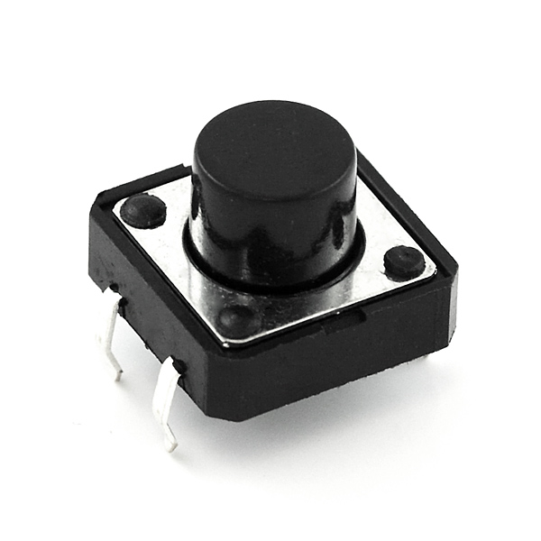

### [Joystick](https://www.sparkfun.com/products/9032)
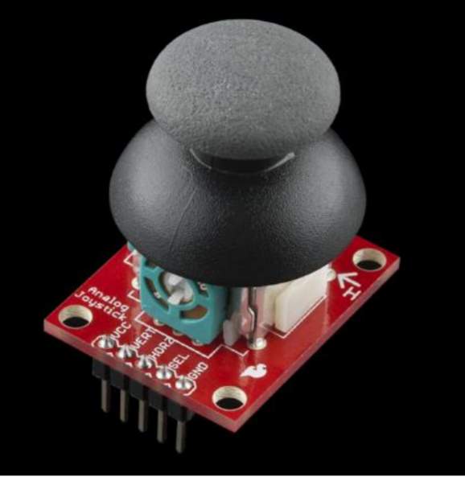

### [Color Graphics LCD Module](https://os.mbed.com/users/4180_1/notebook/ulcd-144-g2-128-by-128-color-lcd/)
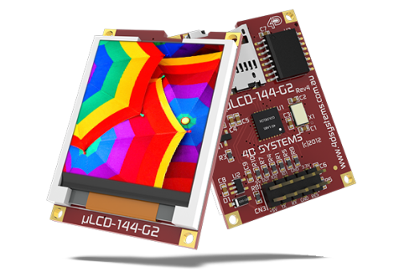

### [Speaker and CLass D Audio Amplifier](https://os.mbed.com/users/4180_1/notebook/using-a-speaker-for-audio-output/)
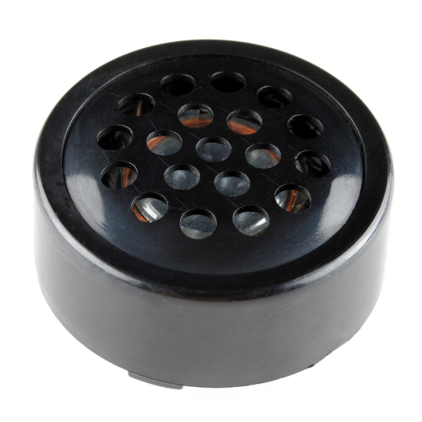
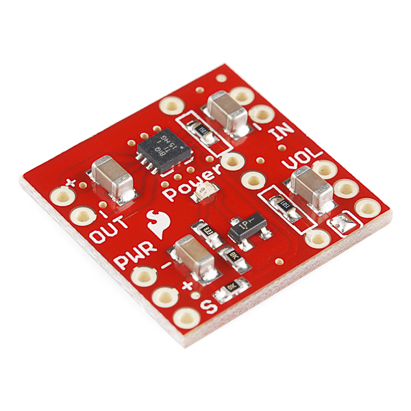

### [Barrel Jack Adapter](https://www.sparkfun.com/products/10811)
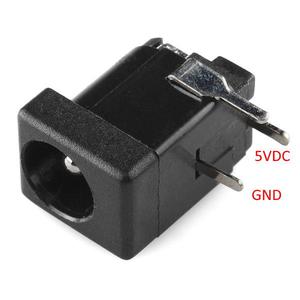

# Wiring Schematic
### Schematic
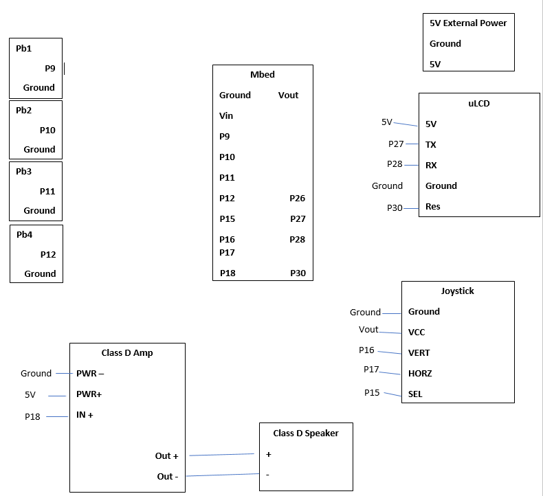

### Pb1
| Mbed | pushbutton |
| ------ | ------ |
| p9 | + |
| Ground | - |
### Pb2
| Mbed | pushbutton |
| ------ | ------ |
| p10 | + |
| Ground | - |
### Pb3
| Mbed | pushbutton |
| ------ | ------ |
| p11 | + |
| Ground | - |
### Pb4
| Mbed | pushbutton |
| ------ | ------ |
| p12 | + |
| Ground | - |

### ULCD
| Mbed | uLCD |
| ------ | ------ |
| Vu | 5V |
| p27 | TX |
| p28 | RX |
| Ground | Ground |
| P30 | Res | 

### Joystick
| Mbed | Joystick |
| ------ | ------ |
| Vout | 5V |
| P16 | VERT |
| p17 | HORZ |
| Ground | Ground |
| P15 | SEL | 

### Class D Amp and Speaker
| Mbed | Class D Amp | External | Speaker|
| ------ | ------ | ------ | ------ |
| Ground | PWR- | Ground | |
|  | PWR+ | 5V | |
| p18 | IN+ | | |
| | Out+ | | + |
| | Out+ | | - |

# Code Overview
To program this guitar hero game, we decided to design state machinge pattern for the game. 
The game has 5 states:
* Main Menu : This the first screen the user sees.
* Choose Difficulty - This is where the user pick difficulty (Easy, Medium Or Hard) 
* Choose Song - This is where the user picks a song (current just 1 song, Schools Out) 
* Start Game - THis is the main portion of the game play
* Game Over - This is where the user will see the score, hits, misses and highscore.


The game will progress cyclically between these 5 states:  
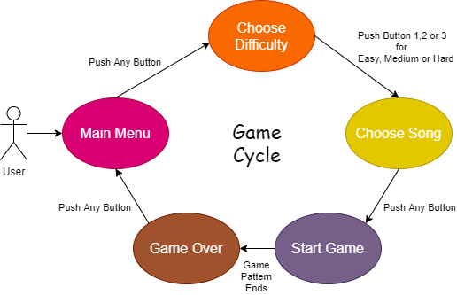

This game runs on Mbed RTOS. There is a dedicated thread that updates the LCD display with the correct content. A switch statement is used to figure out the game state. The buttons are using pindetect library with call back functions. A Ticker is used to play music from flash memory ([How to play sound from flash](https://os.mbed.com/users/4180_1/notebook/using-flash-to-play-audio-clips/)).

# Game Screens
### Main Menu
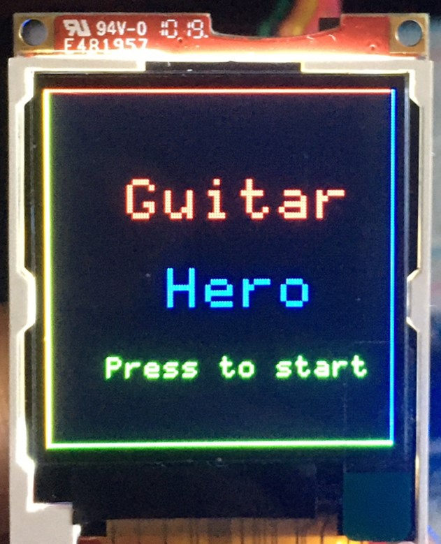

### Difficulty Selection
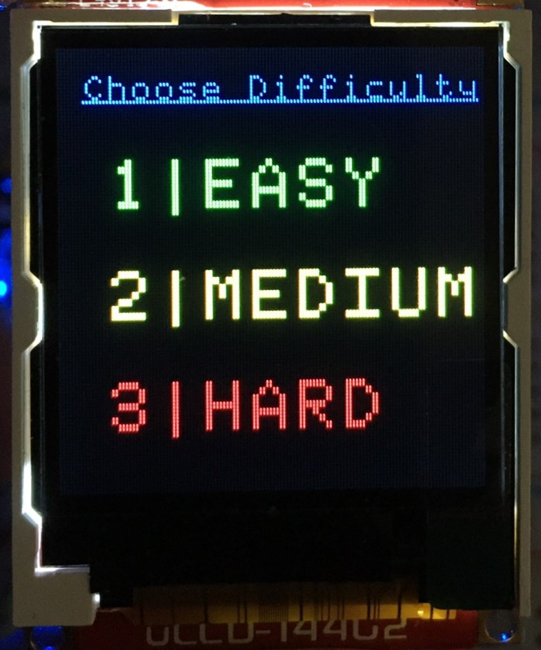

### Song Selection
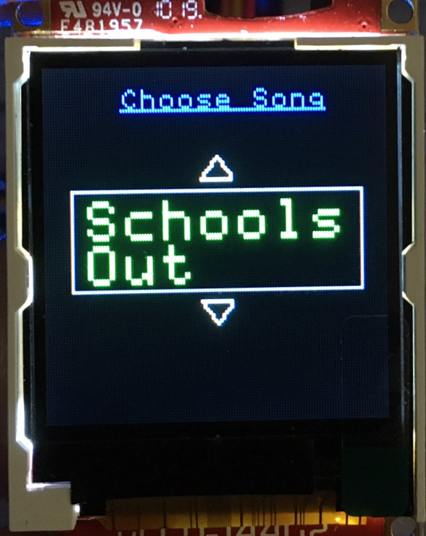

### Start Game
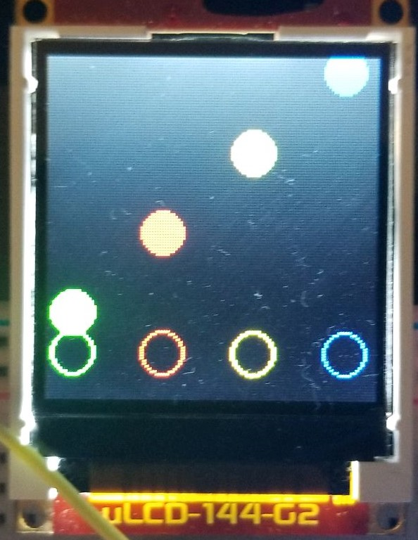

### Game Over
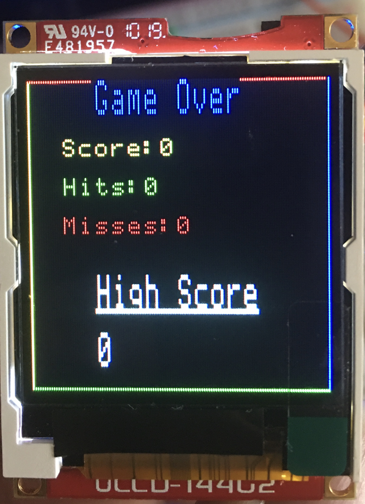


# Demo
```
<video width="640" height="480" controls>
  <source src="./images/Stock.mp4" type="video/mp4">
</video> 
```


### Plugins

Dillinger is currently extended with the following plugins. Instructions on how to use them in your own application are linked below.

| Plugin | README |
| ------ | ------ |
| Dropbox | [plugins/dropbox/README.md][PlDb] |
| GitHub | [plugins/github/README.md][PlGh] |
| Google Drive | [plugins/googledrive/README.md][PlGd] |
| OneDrive | [plugins/onedrive/README.md][PlOd] |
| Medium | [plugins/medium/README.md][PlMe] |
| Google Analytics | [plugins/googleanalytics/README.md][PlGa] |


